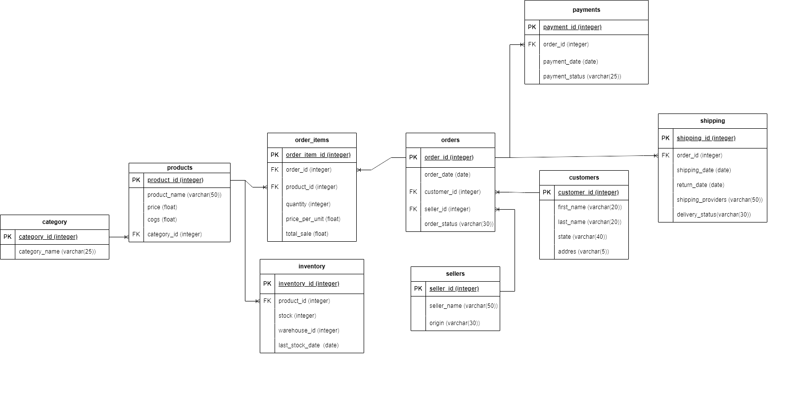

# 🧾 E-Commerce SQL Database Project

This project models the backend structure of an e-commerce platform using SQL Server. It includes relational tables that represent core entities like customers, products, sellers, orders, payments, shipping, and inventory management. The schema is designed to enforce data consistency using primary and foreign key constraints.

---

## 🗂️ Database Schema Overview

The database consists of the following 9 main tables:

### 1. `category`
Stores product categories.

- `category_id` (PK): Unique identifier for each category.
- `category_name`: The name of the product category (e.g., Electronics, Books).

---

### 2. `customers`
Stores customer information.

- `customer_id` (PK): Unique identifier for each customer.
- `first_name`, `last_name`: Customer's full name.
- `state`: Region or state the customer belongs to.

---

### 3. `sellers`
Represents vendors or sellers on the platform.

- `seller_id` (PK): Unique identifier for each seller.
- `seller_name`: Name of the seller or store.
- `origin`: Country or origin of the seller.

---

### 4. `products`
Contains the details of items available for sale.

- `product_id` (PK): Unique product identifier.
- `product_name`: Name of the product.
- `price`: Selling price of the product.
- `cogs`: Cost of Goods Sold (production/purchase cost).
- `category_id` (FK): Linked to the `category` table.

---

### 5. `orders`
Tracks each customer’s order.

- `order_id` (PK): Unique order identifier.
- `order_date`: Date the order was placed.
- `customer_id` (FK): References `customers`.
- `seller_id` (FK): References `sellers`.
- `order_status`: Status of the order (e.g., Pending, Shipped, Cancelled, Returned).

---

### 6. `order_items`
Details the products included in each order.

- `order_item_id` (PK): Unique identifier for each line item.
- `order_id` (FK): References the related order.
- `product_id` (FK): References the purchased product.
- `quantity`: Number of units ordered.
- `price_per_unit`: Price per single unit at the time of order.

---

### 7. `payments`
Captures payment details for each order.

- `payment_id` (PK): Unique ID for each payment.
- `order_id` (FK): References `orders`.
- `payment_date`: When the payment was made.
- `payment_status`: Status (e.g., Success, Failed).

---

### 8. `shippings`
Tracks shipping activity for orders.

- `shipping_id` (PK): Unique ID per shipment.
- `order_id` (FK): References `orders`.
- `shipping_date`: When the product was shipped.
- `return_date`: If returned, when it was returned.
- `shipping_providers`: Delivery company.
- `delivery_status`: Delivery result (e.g., Delivered, In Transit).

---

### 9. `inventory`
Monitors stock levels of each product.

- `inventory_id` (PK): Unique identifier for each stock record.
- `product_id` (FK): References `products`.
- `stock`: Number of available units in stock.
- `warehouse_id`: Location ID (not normalized).
- `last_stock_date`: The last date when stock was updated.

---

## 🔁 Table Relationships (FK Summary)

- `products.category_id` → `category.category_id`
- `orders.customer_id` → `customers.customer_id`
- `orders.seller_id` → `sellers.seller_id`
- `order_items.order_id` → `orders.order_id`
- `order_items.product_id` → `products.product_id`
- `payments.order_id` → `orders.order_id`
- `shippings.order_id` → `orders.order_id`
- `inventory.product_id` → `products.product_id`

## 📊 SQL Scalar and Table-Valued Functions

This project includes a set of SQL functions developed to analyze customer and seller behaviors in an e-commerce database. Below is a short summary of each function:

### 1. `total_payment_amount`
Returns the total amount spent by a given customer between two dates.

### 2. `fn_customer_order_summary`
Provides a summary of a customer's orders including:
- Total amount spent
- Number of orders
- Average items per order

### 3. `fn_seller_performance_summary`
Generates performance metrics for a seller such as:
- Total number of orders
- Total sales revenue
- Quantity of items sold
- Average price per product
- Date of the last order

### 4. `fn_customer_behaviour_scorecard`
Analyzes customer behavior with metrics including:
- Number of unique sellers
- Average order spend
- Favorite product category
- Delivered vs returned orders
- First and last order dates
- Average number of days between order and payment

### 5. `fn_customer_order_dynamics`
Returns a detailed view of each order made by a customer including:
- Order amount and item count
- Rank of the order based on total spend
- Classification of each order as Above/Below Average based on spend

# 📘 Stored Procedures & Triggers Overview

This project includes several SQL Server stored procedures and triggers to manage an e-commerce database. Below is a brief description of each one.

---

## 🧩 Stored Procedures

1. **AddCustomer**  
   Inserts a new customer into the `customers` table.

2. **AddProduct**  
   Adds a product to the `products` table with its price, cost, and category.

3. **AddOrder**  
   Creates a new order associated with a customer and a seller.

4. **AddPayment**  
   Records a payment entry for an order in the `payments` table.

5. **CancelOrder**  
   Cancels an order by updating its status and removing related payments and shipments using a transaction block.

6. **SellProduct**  
   Handles product sales: checks inventory, updates stock, and adds an item to the `order_items` table within a transaction.

7. **sp_customer_purchase_frequency**  
   Lists customers' order frequency and total spending in the last 30 days.

8. **sp_top_valuable_customers**  
   Shows the top 5 customers with the highest spending in the last 3 months.

---

## 🧷 Triggers

1. **trg_orders_default_status**  
   Automatically sets `order_status` to `'Pending'` if not provided during an insert.

2. **trg_set_return_date_on_status_change**  
   Sets the `return_date` in the `shippings` table when the related order's status is updated to `'Returned'`.

---

## 🗂 ER Diagram

